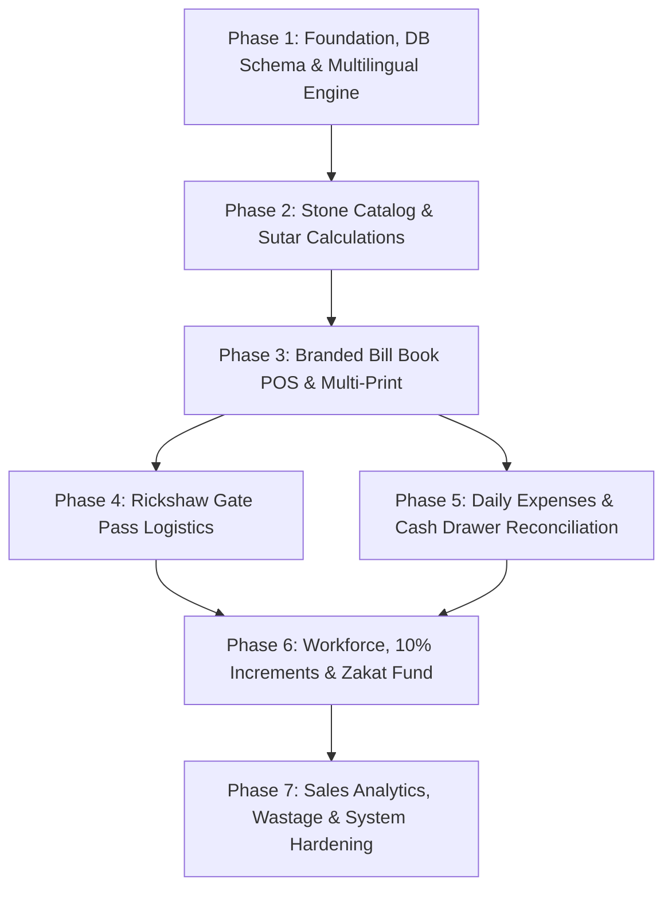

# 🏛️ Rana Shahab Marble Factory & Tiles Management System
## Frontend Modular Architecture & Step-by-Step Implementation Roadmap

**Document Version:** 1.0  
**Target Project:** `Marble-Factory` (Desktop Offline ERP + POS)  
**SRS Reference:** [requirements.md](file:///d:/Uni%20Data/Semester%205/SPM/Marble-Factory/requirements.md) (SRS v2.0)  
**Target Audience:** Development Team, Project Evaluators, Architecture Reviewers  

---

## 1. Executive Summary & Goal Statement

### 1.1. Goal
The objective is to architect and modularize the frontend of the **Rana Shahab Marble Factory & Tiles Management System** into clean, low-coupling, feature-driven modules. This roadmap enables a phased, step-by-step implementation covering specialized stone industry requirements:
- **Branded Bill Book Invoicing & POS** (Rana Shahab authentic header, customer header, A4 replica & 80mm thermal receipts).
- **Industrial Stone Dimensional Engine & Catalog** (4 Sutar thickness classifications: $4, 6, 9, 14\text{ sutar}$, kitchen/stairs indicators, border patti RFT, flower medallions, accessories, and porcelain wall panels).
- **Logistics & Rickshaw Gate Pass System** (delivery dispatch, vehicle & driver tracking, tri-party signatures).
- **Factory Daily Expenses & Cash Drawer Reconciliation** (food/mess, fuel/petrol, client cash advances, end-of-day cash balance).
- **Workforce Management & Social Welfare** (advance salary ledger, automated $10\%$ annual wage promotions, and monthly fixed Zakat distribution for 3–4 families).
- **Bilingual & Urdu Engine** (English, Urdu Nastaleeq RTL, Dual Mode, and built-in on-screen Urdu phonetic typing).
- **Comprehensive Sales & P&L Analytics** (Daily, Weekly, Monthly, Yearly, and Custom date ranges).

---

## 2. Current Architecture & Codebase Gap Analysis

### 2.1. Codebase Inventory
An inspection of the workspace reveals the following existing files and structure:

| File / Directory | Current Purpose | Gap Relative to SRS v2.0 |
| :--- | :--- | :--- |
| [src/App.jsx](file:///d:/Uni%20Data/Semester%205/SPM/Marble-Factory/src/App.jsx) | Root state, theme switcher, view routing, auth gate | Uses hardcoded view switching without centralized route/module state; missing navigation for 5 new SRS modules. |
| [src/components/Sidebar.jsx](file:///d:/Uni%20Data/Semester%205/SPM/Marble-Factory/src/components/Sidebar.jsx) | Navigation sidebar | Lacks entries for Gate Passes, Daily Expenses, Sales Reports, Employees/Payroll, Zakat, and Urdu switcher. |
| [src/components/Header.jsx](file:///d:/Uni%20Data/Semester%205/SPM/Marble-Factory/src/components/Header.jsx) | Top bar with time, theme, backup | Lacks language switcher toggle (EN / UR / Dual) and live cash drawer indicator. |
| [src/components/DimensionCalculator.jsx](file:///d:/Uni%20Data/Semester%205/SPM/Marble-Factory/src/components/DimensionCalculator.jsx) | Pop-up modal for calculating Sq. Ft. | Only supports basic $L \times W$; lacks Sutar thickness selection, R.T.F calculation for border patti, and box-to-sqft conversion. |
| [src/views/BillingView.jsx](file:///d:/Uni%20Data/Semester%205/SPM/Marble-Factory/src/views/BillingView.jsx) | Invoicing and POS billing interface | Lacks Rana Shahab factory header branding, carrier delivery field, Sutar selectors, dual Urdu labels, and A4 bill book replica print. |
| [src/views/StockManagementView.jsx](file:///d:/Uni%20Data/Semester%205/SPM/Marble-Factory/src/views/StockManagementView.jsx) | Item inventory table & modal | Does not support the 4 Sutar categories, Flower medallions, Border patti (RFT), Accessories (Bond/Filling/Spacers/Golla), or Wall Panels. |
| [src/views/CustomerLedgerView.jsx](file:///d:/Uni%20Data/Semester%205/SPM/Marble-Factory/src/views/CustomerLedgerView.jsx) | Customer accounts & balances | Needs customer history timeline linking Rickshaw gate passes, payment recovery vouchers, and dual language. |
| [src/views/ReturnsView.jsx](file:///d:/Uni%20Data/Semester%205/SPM/Marble-Factory/src/views/ReturnsView.jsx) | Stock and sales returns | Lacks factory breakage and bridge-cutter cutting wastage logging (FR-RET-02). |
| [src/views/SettingsView.jsx](file:///d:/Uni%20Data/Semester%205/SPM/Marble-Factory/src/views/SettingsView.jsx) | Factory settings & backup | Currently stores generic seed details instead of authentic Rana Shahab factory details. |
| [src/db/index.js](file:///d:/Uni%20Data/Semester%205/SPM/Marble-Factory/src/db/index.js) | Dexie.js database schema | Schema missing tables for: `gate_passes`, `daily_expenses`, `employees`, `employee_advances`, `zakat_records`, and `wastage_logs`. |
| [src/db/seedData.js](file:///d:/Uni%20Data/Semester%205/SPM/Marble-Factory/src/db/seedData.js) | Initial database records | Lacks default records for Rana Shahab branding, marble varieties with Sutar data, sample employees, and Zakat beneficiaries. |

---

## 3. Core Architectural Decisions (Learn-by-Doing Framework)

Before modifying the application, we establish explicit architectural decisions. Each decision explains the concept, tradeoffs, and rationale for this project.

### Decision 1: Frontend Folder Structure — Feature-Based Modules vs. Flat Component Dumps

**Concept:** Feature-based modular architecture groups all related files (components, calculation helpers, types, and hooks) into dedicated feature directories (e.g., `src/modules/billing/` or `src/features/gate-pass/`), rather than scattering them across global `components/` and `views/` folders.

**Tradeoff Comparison:**

| Approach | What it Means | Pros | Cons | Best When |
| :--- | :--- | :--- | :--- | :--- |
| **Option A: Flat `views/` + `components/`** | Keeping all screens in `src/views/` and shared widgets in `src/components/`. | Simple for small apps (<5 screens). No directory nesting. | Becomes disorganized as business logic grows; files exceed 800+ lines; high coupling between views. | Rapid prototyping of tiny single-purpose apps. |
| **Option B: Feature-Based Modular Architecture (Recommended)** | Creating isolated folders per domain module (`src/modules/<module-name>/`) containing view, sub-components, and helpers. | Strong domain cohesion, low coupling, easier step-by-step implementation, isolated testing, clear boundaries. | Slight initial folder setup overhead. | Complex enterprise ERPs with 8+ distinct domains like stone POS, logistics, and payroll. |
| **Option C: Micro-Frontends** | Independent runtime sub-apps loaded dynamically. | Independent deployments. | Massive operational overhead, bundle size duplication, breaks single-process offline Electron app. | Multi-team cloud web platforms with separate release cycles. |

**Recommendation:** **Option B (Feature-Based Modular Architecture)**.  
**Why for this project:** The Rana Shahab ERP contains 12 functional modules with specialized industrial logic (e.g., Sutar conversions, Rickshaw gate slips, Zakat ledgers). Feature isolation ensures one module can be implemented, updated, or tested without destabilizing others.

---

### Decision 2: Multilingual & Urdu Engine Strategy — Custom React Context vs External i18n Framework

**Concept:** Multilingual support requires dynamic switching between English, Urdu Nastaleeq (RTL), and Dual/Bilingual parallel layout, plus an integrated phonetic keyboard that works without OS-level Urdu language pack installations.

**Tradeoff Comparison:**

| Approach | What it Means | Pros | Cons | Best When |
| :--- | :--- | :--- | :--- | :--- |
| **Option A: Heavy Library (`i18next` + `react-i18next`)** | Standard internationalization library with JSON locale bundles. | Standardized pluralization, ecosystem tooling. | Unnecessary bundle bloat for desktop offline app; lacks built-in dual-label rendering and phonetic Urdu keymap. | Multi-country SaaS supporting 20+ world languages. |
| **Option B: Lightweight Factory Language Context + Virtual Phonetic Keymap (Recommended)** | React Context (`LanguageContext.jsx`) holding active mode (`'en' | 'ur' | 'dual'`), translation dictionary, RTL attribute toggle, and a phonetic character map (`k` $\rightarrow$ `ک`, `g` $\rightarrow$ `گ`, `m` $\rightarrow$ `م`). | Zero external dependencies, native support for Dual bilingual labels (e.g., *Customer Name / جناب نام گاہک*), instantaneous RTL/LTR switching, tailored for Pakistani industrial keyboards. | Requires maintaining the dictionary file directly in the codebase. | Offline desktop ERPs tailored to regional Pakistani industrial domains. |

**Recommendation:** **Option B (Lightweight Language Context + Phonetic Keymap)**.  
**Why for this project:** The requirement specifically demands dual-label printing on bill books and an on-screen phonetic typing helper that works offline without OS language packs.

---

### Decision 3: Offline Data Persistence & Reactive Sync — Dexie.js LiveQuery vs Global Redux/Zustand

**Concept:** The app is 100% offline-first inside Electron. When invoices are billed or expenses logged, UI components must react immediately to IndexedDB updates.

**Tradeoff Comparison:**

| Approach | What it Means | Pros | Cons | Best When |
| :--- | :--- | :--- | :--- | :--- |
| **Option A: Global Redux/Zustand State with manual Dexie Sync** | In-memory store; reads and writes sync back and forth to Dexie manually. | Centralized dispatch log. | Two sources of truth; dual-write synchronization bugs; stale in-memory cache if Dexie writes fail. | Cloud apps relying on WebSockets or optimistic REST updates. |
| **Option B: Dexie Reactive `useLiveQuery` Hook (Recommended)** | Directly query IndexedDB via `dexie-react-hooks`; components auto-render when local database tables change. | Single source of truth, zero synchronization boilerplate, bulletproof offline reliability, atomic IndexedDB transactions. | Requires `dexie-react-hooks` or small custom reactive wrappers. | High-reliability offline desktop ERP applications. |

**Recommendation:** **Option B (Dexie Reactive Queries with Atomic Transactions)**.  
**Why for this project:** In a factory environment, sudden power outages or app restarts must never corrupt pending transactions. Atomic Dexie transactions directly at the storage boundary guarantee data integrity.

---

### Decision 4: Printable Document Generation — Clean CSS `@media print` vs Canvas/PDF Rendering

**Concept:** Generating printable outputs for A4 Bill Books, 80mm thermal cash slips, and Rickshaw Gate Passes.

**Tradeoff Comparison:**

| Approach | What it Means | Pros | Cons | Best When |
| :--- | :--- | :--- | :--- | :--- |
| **Option A: Client-side PDF Generation (`jspdf` / `pdfmake`)** | Generating binary PDF files in memory before triggering download or print. | Exact pixel control across OS platforms. | Slow rendering on budget factory PCs, poor font rendering for Urdu Nastaleeq, cumbersome styling workflow. | Generating compliance documents intended for email attachments. |
| **Option B: Dedicated CSS `@media print` Templates (Recommended)** | Creating dedicated HTML/CSS print components rendered into an invisible or modal container, styled via `@media print`. | Native OS print dialog, fast rendering, perfect crisp vector typography for Urdu Nastaleeq, supports both 80mm roll and A4 sheet. | Requires careful CSS print page-break rules. | POS cashier counters and factory gate printing. |

**Recommendation:** **Option B (Dedicated CSS `@media print` Templates)**.  
**Why for this project:** Cashiers need sub-second printing of thermal slips and A4 bill books without waiting for heavy PDF generation.

---

## 4. Frontend Modular Breakdown (12 Modules)

The frontend is partitioned into 12 distinct, self-contained functional modules matching Section 5 of the SRS.

```
src/
├── modules/
│   ├── mod_01_dashboard/        # Executive KPIs, Receivables, Cash Drawer Summary
│   ├── mod_02_billing_pos/       # Branded Bill Book POS & A4/Thermal Print Engine
│   ├── mod_03_catalog_stone/     # Sutar Thickness (4/6/9/14), Standard Cuts, Accessories
│   ├── mod_04_gate_pass/         # Logistics & Rickshaw Dispatch Gate Out Passes
│   ├── mod_05_customer_ledger/   # Customer Profiles, History, Udhar Recovery Vouchers
│   ├── mod_06_daily_expenses/    # Food/Mess, Petrol, Customer Udhar, Cash Drawer Close
│   ├── mod_07_sales_reports/     # Daily, Weekly, Monthly, Yearly & Custom Range P&L
│   ├── mod_08_employees_payroll/ # Staff Roster, Salary Advances, 10% Annual Increments
│   ├── mod_09_zakat_welfare/     # Fixed Monthly Zakat Ledger for 3-4 Beneficiaries
│   ├── mod_10_multilingual/      # English/Urdu/Dual Engine & Phonetic Virtual Keyboard
│   ├── mod_11_returns_wastage/   # Sales Returns & Factory Bridge-Cutter Breakage Logs
│   └── mod_12_settings_backup/   # Rana Shahab Factory Profile & Full JSON Backup/Restore
├── shared/
│   ├── components/               # Base UI (Badge, Modal, Button, Table, Input)
│   ├── utils/                    # Stone Calculations (Sutar, Sq.Ft, R.T.F, Box conversion)
│   └── context/                  # LanguageContext & AppNotificationContext
```

---

### Module 1: Executive Dashboard (MOD-01)
- **Urdu Title:** ڈیش بورڈ و فیکٹری جائزہ
- **Directory:** `src/modules/mod_01_dashboard/`
- **Primary View:** `DashboardView.jsx`
- **Sub-Components:**
  - `MetricCard.jsx` (Sales revenue, total Udhar receivables, live cash in drawer, active low-stock count)
  - `CashDrawerWidget.jsx` (Live drawer calculation: Opening Cash + Today's Cash In - Expenses)
  - `LowStockAlertTable.jsx` (Items falling below min-stock threshold with Sutar thickness badge)
  - `QuickActionButtons.jsx` (New Branded Bill, New Rickshaw Gate Pass, Add Expense, Record Recovery)
- **Key Formulas & Calculations:**
  $$\text{Live Drawer Cash} = \text{Opening Balance} + \text{Today's Cash Sales} + \text{Customer Recoveries} - \sum (\text{Today's Expenses})$$
- **Verification:** KPIs update immediately upon completing a bill, recording an expense, or settling customer Udhar.

---

### Module 2: Factory Bill Book & POS Engine (MOD-02)
- **Urdu Title:** فیکٹری بل بک و سیلز
- **Directory:** `src/modules/mod_02_billing_pos/`
- **Primary View:** `BillingView.jsx`
- **Sub-Components:**
  - `BillBookHeader.jsx` (Branded factory title, slogans, address, phone numbers, serial number & date)
  - `CustomerInfoSection.jsx` (Customer name, mobile number, delivery/site address, delivered via carrier)
  - `LineItemsGrid.jsx` (Item dropdown, Sutar thickness badge, dimensions, pieces, RTF, Sq.Ft, rate, subtotal)
  - `InvoiceSummaryFooter.jsx` (Gross total, Carriage, Labour, Polish, Discount, Net total, Advance paid, Remaining Udhar, Dual signatures)
  - `PrintEngineModal.jsx` (Multi-format selector: Authentic A4 Bill Book replica vs. 80mm Thermal Cash slip vs. Gate dispatch summary)
  - `SutarSelector.jsx` (Quick selector buttons for 4 Sutar, 6 Sutar with Kitchen/Stairs badge, 9 Sutar, 14 Sutar)
- **Key Formulas:**
  $$\text{Line Sq. Ft} = \left( \frac{\text{Length (in)} \times \text{Width (in)}}{144} \right) \times \text{Pieces}$$
  $$\text{Grand Total} = \sum (\text{Line Subtotals}) + \text{Carriage} + \text{Labour} + \text{Polishing} - \text{Discount}$$
  $$\text{Balance Due (Udhar)} = \text{Grand Total} - \text{Paid Amount}$$
- **Verification:** Generates an invoice with authentic Rana Shahab bill book formatting, updates stock, and creates an automatic outstanding Udhar record if balance > 0.

---

### Module 3: Product Catalog & Stone Master (MOD-03)
- **Urdu Title:** مصنوعات و ماربل اسٹاک
- **Directory:** `src/modules/mod_03_catalog_stone/`
- **Primary View:** `StockManagementView.jsx`
- **Sub-Components:**
  - `CategoryTabs.jsx` (Marble Slabs, Finished Tiles, Medallion Flowers, Borders/Patti, Porcelain & Panels, Accessories)
  - `StoneItemModal.jsx` (Form with Sutar thickness radio, standard size quick-picks, unit selection, cost & retail price)
  - `SutarBadge.jsx` (Visual indicators for 4 Sutar, 6 Sutar *[Kitchen/Sidhi]*, 9 Sutar, 14 Sutar)
  - `StockAdjustmentModal.jsx` (Manual stock corrections with reason logging)
- **Catalog Coverage:**
  - Varieties: Sunny Grey, Badal, Ziarat White, Gobra, Tavera, Botticino.
  - Sutar Classification: 4 Sutar ($0.5''$), 6 Sutar ($0.75''$ - Kitchen/Stairs/Lift), 9 Sutar ($1.125''$), 14 Sutar ($1.75''$).
  - Cut Sizes: $12\times12, 12\times24, 6\times12, 6\times24$, Custom Slabs.
  - Flower Medallions: $12\times12, 24\times24, 3\times3\text{ ft}$.
  - Borders & Patti: $2'', 3'', 6''$ (tracked by Running Total Feet).
  - Accessories: Bond (adhesive), Filling (grout), Spacers, Golla / Chamfer molding.
  - Porcelain & Panels: $12\times24, 16\times16, 24\times24, 24\times48, \text{3D Wall Panels}$.
- **Verification:** Stock quantities increment on purchase/intake and decrement automatically upon POS invoice generation.

---

### Module 4: Rickshaw Gate Pass Logistics (MOD-04)
- **Urdu Title:** رکشہ گیٹ پاس و ڈسپیچ
- **Directory:** `src/modules/mod_04_gate_pass/`
- **Primary View:** `GatePassView.jsx`
- **Sub-Components:**
  - `GatePassList.jsx` (Table of recent dispatches, status: Dispatched / In Transit / Delivered)
  - `GatePassEntryModal.jsx` (Invoice picker, vehicle type selector [Qingqi / Loader / Truck / Carry], vehicle reg #, driver name & mobile, delivery destination)
  - `PrintableGateSlip.jsx` (Half-page printable slip containing manifest, driver info, and 3 signature blocks: Gate Supervisor, Rickshaw Driver, Receiver)
- **Data Contract:**
  ```javascript
  {
    gatePassNo: "GP-2026-0001",
    invoiceId: 101,
    invoiceNo: "INV-2026-0042",
    customerName: "Muhammad Imran",
    destination: "Satyana Road, Near Fish Farm",
    vehicleType: "Qingqi Rickshaw",
    vehicleRegNo: "FD-4821",
    driverName: "Karamat Ali",
    driverPhone: "0301-7654321",
    dispatchDate: "2026-09-27T17:30:00.000Z",
    manifest: [
      { name: "Sunny Grey 6 Sutar", size: "12x24", pieces: 80, sqFt: 160 }
    ],
    status: "Dispatched"
  }
  ```
- **Verification:** Generates a printable gate pass linked to an invoice with driver information and signature lines.

---

### Module 5: Customer Profiles, Udhar & Ledgers (MOD-05)
- **Urdu Title:** گاہک ریکارڈ، کھاتہ و بقایا جات
- **Directory:** `src/modules/mod_05_customer_ledger/`
- **Primary View:** `CustomerLedgerView.jsx`
- **Sub-Components:**
  - `CustomerList.jsx` (Search by name/phone, balance summary, customer type)
  - `CustomerProfileModal.jsx` (Create/Edit customer info, credit limit)
  - `CustomerTimelineView.jsx` (Chronological history: Invoices, Gate Passes, Payments Received, Returns)
  - `PaymentRecoveryModal.jsx` (Accept customer debt recovery payments with auto-allocation to oldest unpaid balance and printable recovery receipt)
- **Key Formulas:**
  $$\text{New Outstanding Balance} = \text{Prior Balance} + \text{Invoice Balance Due} - \text{Payments Received}$$
- **Verification:** Adding a partial payment immediately reduces the customer's balance and logs a cash recovery in the daily cash drawer.

---

### Module 6: Daily Expenses & Cash Drawer Management (MOD-06)
- **Urdu Title:** روزانہ فیکٹری اخراجات و کیش دراز
- **Directory:** `src/modules/mod_06_daily_expenses/`
- **Primary View:** `DailyExpensesView.jsx`
- **Sub-Components:**
  - `ExpenseEntryForm.jsx` (Category quick-selector: Food/Mess, Petrol/Fuel, Customer Udhar Advance, Factory Overhead; Amount, Paid To, Remarks)
  - `DailyExpenseTable.jsx` (Today's expense list with filter by category)
  - `DayEndReconciliationCard.jsx` (Opening balance, cash sales, debt recoveries, expenses, computed closing balance, actual physical count variance)
  - `PrintableDayClosingSheet.jsx` (Printable daily financial summary for the Factory Owner)
- **Key Formulas:**
  $$\text{Expected Closing Cash} = \text{Opening Balance} + \text{Today's Cash Sales} + \text{Customer Recoveries} - \sum (\text{Expenses})$$
  $$\text{Variance} = \text{Physical Cash Counted} - \text{Expected Closing Cash}$$
- **Verification:** Daily expenses immediately deduct from the live cash drawer balance and reflect on the day-end closing report.

---

### Module 7: Comprehensive Sales & P&L Analytics (MOD-07)
- **Urdu Title:** سیلز رپورٹس و منافع کا تجزیہ
- **Directory:** `src/modules/mod_07_sales_reports/`
- **Primary View:** `SalesReportsView.jsx`
- **Sub-Components:**
  - `TimeHorizonTabs.jsx` (Daily, Weekly, Monthly, Yearly, Custom Date Range)
  - `SalesMetricOverview.jsx` (Total sales volume, gross profit, discount awarded, cash vs credit ratio)
  - `CategoryBreakdownChart.jsx` (Sales distribution by Marble type, Sutar thickness: 4 vs 6 vs 9 vs 14 Sutar, Tiles & Accessories)
  - `TopCustomersTable.jsx` (Ranked list of highest revenue customers)
  - `ExportReportModal.jsx` (Printable summary and CSV/JSON export)
- **Verification:** Aggregations for date ranges match exact invoice line items and calculate profit margins correctly.

---

### Module 8: Employee Roster & 10% Increment Payroll (MOD-08)
- **Urdu Title:** ملازمین، تنخواہیں و سالانہ ترقی
- **Directory:** `src/modules/mod_08_employees_payroll/`
- **Primary View:** `EmployeesPayrollView.jsx`
- **Sub-Components:**
  - `EmployeeRosterTable.jsx` (Staff list: Name, Role [Cutter Master, Polish Master, Yard Labourer, Driver, Cashier], Joining Date, Basic Salary, Advance Drawn)
  - `AdvanceSalaryModal.jsx` (Log mid-month cash advances taken by an employee)
  - `IncrementEngineCard.jsx` (Anniversary alert highlighting employees completing 1 year of service; 1-click $10\%$ salary increment applicator)
  - `MonthlyPayrollSheet.jsx` (Calculates Net Payout = Base Salary - Advances Taken; marks monthly salary as paid)
- **Key Formulas:**
  $$\text{Automated 10% Increment} = \text{Current Base Salary} \times 1.10$$
  $$\text{Net Monthly Payout} = \text{Base Salary} - \text{Total Advances Drawn}$$
- **Verification:** Recording an advance decreases net monthly payout; applying the anniversary increment increases base salary by exactly 10%.

---

### Module 9: Monthly Zakat & Social Welfare Fund (MOD-09)
- **Urdu Title:** ماہانہ زکوٰۃ فنڈ و امداد
- **Directory:** `src/modules/mod_09_zakat_welfare/`
- **Primary View:** `ZakatManagementView.jsx`
- **Sub-Components:**
  - `BeneficiaryDirectory.jsx` (Fixed roster of 3–4 deserving families: Name, CNIC, Phone, Fixed Monthly Amount, Notes)
  - `MonthlyDisbursementLog.jsx` (Records monthly payments with status: Paid / Pending, payment mode: Cash / EasyPaisa / Bank)
  - `AnnualZakatAuditCard.jsx` (Year-to-date total Zakat disbursed summary)
- **Data Contract:**
  ```javascript
  {
    beneficiaryId: 1,
    name: "Widow of Late Rasheed",
    cnic: "33102-1234567-8",
    phone: "0300-1234567",
    monthlyAmount: 8000,
    monthYear: "September 2026",
    status: "Disbursed",
    disbursementDate: "2026-09-05",
    paymentMethod: "Cash"
  }
  ```
- **Verification:** Tracks monthly disbursement status for all registered beneficiaries and prevents duplicate payouts for the same month.

---

### Module 10: Multilingual & Urdu Engine with Phonetic Keyboard (MOD-10)
- **Urdu Title:** کثیر لسانی انجن و اردو فونیٹک کی بورڈ
- **Directory:** `src/modules/mod_10_multilingual/`
- **Core Files:**
  - `LanguageContext.jsx` (Active language state: `'en'`, `'ur'`, `'dual'`; text translation lookup `t('key')`)
  - `UrduPhoneticKeyboard.jsx` (On-screen virtual keyboard with phonetic layout)
  - `usePhoneticUrdu.js` (Custom React hook enabling physical keyboard phonetic mapping on text inputs)
  - `translations.js` (Dictionary containing all system terms in English and authentic Urdu)
- **Phonetic Key Mapping Sample:**
  ```javascript
  const PHONETIC_MAP = {
    'a': 'ا', 'b': 'ب', 'p': 'پ', 't': 'ت', 'T': 'ٹ', 's': 'س',
    'j': 'ج', 'c': 'چ', 'h': 'ح', 'k': 'ک', 'g': 'گ', 'l': 'ل',
    'm': 'م', 'n': 'ن', 'w': 'و', 'y': 'ی', 'r': 'ر', 'd': 'د'
  };
  ```
- **Verification:** Toggling language switches UI labels instantly; in Urdu mode, document direction becomes RTL with Noto Nastaliq Urdu font; typing with phonetic hook converts keystrokes to Urdu characters.

---

### Module 11: Stock Returns & Factory Breakage Wastage (MOD-11)
- **Urdu Title:** واپسی مال و فیکٹری کٹائی نقصان
- **Directory:** `src/modules/mod_11_returns_wastage/`
- **Primary View:** `ReturnsView.jsx`
- **Sub-Components:**
  - `CustomerReturnsTab.jsx` (Return unused/damaged tiles from customers, reverse credit balance, restock items)
  - `FactoryWastageTab.jsx` (Log breakage during gangsaw processing, bridge-cutter trimming, or yard transit)
  - `WastageReportSummary.jsx` (Total Sq. Ft. lost to cutting breakage and financial loss value)
- **Verification:** Breakage logs deduct from physical inventory without impacting customer accounts, while customer returns credit the customer ledger and restore stock.

---

### Module 12: Factory Settings & Local Database Backup (MOD-12)
- **Urdu Title:** فیکٹری ترتیبات و بیک اپ
- **Directory:** `src/modules/mod_12_settings_backup/`
- **Primary View:** `SettingsView.jsx`
- **Sub-Components:**
  - `FactoryProfileForm.jsx` (Authentic Rana Shahab Factory branding, slogans, landline, mobile numbers, address)
  - `PrintTemplateSettings.jsx` (Default invoice format: A4 vs 80mm thermal, custom receipt terms)
  - `DatabaseBackupRestore.jsx` (1-click export of complete Dexie database to `.json`, file upload restore with verification)
- **Verification:** Updating factory contact numbers reflects immediately on all printed bill books and gate passes.

---

## 5. Step-by-Step Implementation Roadmap

The implementation is broken into 6 logical phases. Each phase contains 15–60 minute tasks with clear dependencies and verification checks.



---

### Phase 1: Database Schema Expansion, Seed Data & Multilingual Engine
*Estimated Time: 1.5 - 2 Hours*

- [ ] **Task 1.1: Expand Dexie Database Schema**
  - **File:** [src/db/index.js](file:///d:/Uni%20Data/Semester%205/SPM/Marble-Factory/src/db/index.js)
  - **Changes:** Add new Dexie stores: `gate_passes`, `daily_expenses`, `employees`, `employee_advances`, `zakat_records`, `wastage_logs`.
  - **Verification:** Open browser DevTools $\rightarrow$ IndexedDB $\rightarrow$ `MarbleFactoryDB` confirms all new tables exist.
- [ ] **Task 1.2: Update Seed Data with Rana Shahab Authentic Branding**
  - **File:** [src/db/seedData.js](file:///d:/Uni%20Data/Semester%205/SPM/Marble-Factory/src/db/seedData.js)
  - **Changes:** Replace generic company name with *Rana Shahab Marble Factory*, add slogans, phone numbers (`0321-6606645`, `0300-6664187`, `0300-7995171`), seed 4 Sutar items, 3 sample employees, and 3 Zakat beneficiaries.
  - **Verification:** Reset database and verify `db.settings` and `db.items` hold authentic Rana Shahab records.
- [ ] **Task 1.3: Build Multilingual Engine & Urdu Phonetic Context**
  - **Files:** `src/modules/mod_10_multilingual/LanguageContext.jsx`, `src/modules/mod_10_multilingual/translations.js`, `src/modules/mod_10_multilingual/usePhoneticUrdu.js`
  - **Changes:** Provide `useLanguage()` hook with English, Urdu, and Dual mode support; implement phonetic key mapping.
  - **Verification:** Switch language toggle in UI; check that labels change to Urdu and document body sets `dir="rtl"`.

---

### Phase 2: Stone Catalog, Sutar Thickness & Industrial Calculations
*Estimated Time: 1.5 - 2 Hours*

- [ ] **Task 2.1: Implement Pure Stone Calculation Engine**
  - **File:** `src/shared/utils/stoneCalculations.js`
  - **Changes:** Implement pure functions: `calculateSqFtFromInches(l, w, pcs)`, `calculateSqFtFromFeet(l, w, pcs)`, `calculateRunningFeet(l, pcs)`, `sutarToFraction(sutar)`, `boxToSqFt(boxes, sqFtPerBox)`.
  - **Verification:** Unit test calculations against standard factory benchmarks ($12'' \times 24'' \times 10 \text{ pcs} = 20.00 \text{ Sq. Ft.}$).
- [ ] **Task 2.2: Upgrade Dimension Calculator Modal**
  - **File:** [src/components/DimensionCalculator.jsx](file:///d:/Uni%20Data/Semester%205/SPM/Marble-Factory/src/components/DimensionCalculator.jsx)
  - **Changes:** Add Sutar thickness selector ($4, 6, 9, 14\text{ sutar}$), Running Total Feet tab for borders, and box conversion tab.
  - **Verification:** Opening calculator in Billing updates row dimensions, Sutar thickness, and calculated Sq. Ft. accurately.
- [ ] **Task 2.3: Upgrade Stone Catalog View (MOD-03)**
  - **File:** `src/modules/mod_03_catalog_stone/StockManagementView.jsx`
  - **Changes:** Add category tabs for Slabs, Tiles, Flowers, Borders (RFT), Accessories, and Porcelain Panels. Display 6 Sutar *[Kitchen/Sidhi]* badges.
  - **Verification:** Filter catalog by "Borders & Patti" or "Flower Medallions"; confirm correct units (RFT vs Pieces vs Sq. Ft.).

---

### Phase 3: Branded Bill Book POS Engine & Multi-Format Printing
*Estimated Time: 2 - 2.5 Hours*

- [ ] **Task 3.1: Re-architect Billing View (MOD-02)**
  - **File:** `src/modules/mod_02_billing_pos/BillingView.jsx`
  - **Changes:** Restructure into sub-components (`BillBookHeader`, `CustomerInfoSection`, `LineItemsGrid`, `InvoiceSummaryFooter`).
  - **Verification:** Create an invoice with custom customer details, carrier transport note, and multiple marble lines.
- [ ] **Task 3.2: Build Authentic A4 Bill Book Replica Print Template**
  - **File:** `src/modules/mod_02_billing_pos/A4BillBookPrint.jsx`
  - **Changes:** Create A4 layout mirroring the physical factory receipt book: Rana Shahab header, slogans, serial #, Urdu column headers, dual signature blocks, and terms & conditions.
  - **Verification:** Click "Print A4 Bill Book" $\rightarrow$ Print preview renders exact factory bill book layout.
- [ ] **Task 3.3: Maintain 80mm Thermal Receipt Modal**
  - **File:** [src/components/ThermalReceiptModal.jsx](file:///d:/Uni%20Data/Semester%205/SPM/Marble-Factory/src/components/ThermalReceiptModal.jsx)
  - **Changes:** Update header to Rana Shahab branding and include Sutar thickness on line items.
  - **Verification:** Print preview displays clean 80mm thermal slip.

---

### Phase 4: Logistics & Rickshaw Gate Pass System
*Estimated Time: 1.5 Hours*

- [ ] **Task 4.1: Create Gate Pass Service & Dexie Queries**
  - **File:** `src/modules/mod_04_gate_pass/gatePassService.js`
  - **Changes:** Functions to generate gate pass numbers (`GP-YYYY-XXXX`), link to invoices, fetch pending delivery items.
  - **Verification:** Calling `createGatePass()` creates record in `db.gate_passes`.
- [ ] **Task 4.2: Build Gate Pass Management View (MOD-04)**
  - **File:** `src/modules/mod_04_gate_pass/GatePassView.jsx`
  - **Changes:** Table of dispatches with vehicle search, dispatch button, and status badges.
  - **Verification:** Modal captures vehicle type (Qingqi / Loader), registration #, driver phone, and destination.
- [ ] **Task 4.3: Implement Printable Rickshaw Gate Out Slip**
  - **File:** `src/modules/mod_04_gate_pass/PrintableGateSlip.jsx`
  - **Changes:** Half-page printable slip containing manifest and 3 signature blocks (Gate Incharge, Rickshaw Driver, Customer).
  - **Verification:** Printed slip fits half-page A4 and contains driver and customer verification info.

---

### Phase 5: Daily Expenses & Cash Drawer Reconciliation
*Estimated Time: 1.5 Hours*

- [ ] **Task 5.1: Build Daily Expenses View (MOD-06)**
  - **File:** `src/modules/mod_06_daily_expenses/DailyExpensesView.jsx`
  - **Changes:** Quick-entry form with 4 factory expense categories: Food/Mess, Petrol/Fuel, Customer Udhar Advance, and Factory Overhead.
  - **Verification:** Logging a food/mess expense creates record in `db.daily_expenses`.
- [ ] **Task 5.2: Implement Live Cash Drawer Reconciliation Card**
  - **File:** `src/modules/mod_06_daily_expenses/CashReconciliationCard.jsx`
  - **Changes:** Live calculation of Opening Cash + Cash Invoices + Udhar Recoveries - Daily Expenses.
  - **Verification:** Drawer balance recalculates instantly when an expense is added or deleted.
- [ ] **Task 5.3: Build Printable Day-End Closing Sheet**
  - **File:** `src/modules/mod_06_daily_expenses/PrintableDayClosingSheet.jsx`
  - **Changes:** Printable summary for the factory owner detailing cash breakdown and expense receipts.
  - **Verification:** Print preview renders clean day-end financial report.

---

### Phase 6: Workforce, 10% Increments, Zakat & Sales Analytics
*Estimated Time: 2 - 2.5 Hours*

- [ ] **Task 6.1: Build Employee Management & Advance Salary Ledger (MOD-08)**
  - **File:** `src/modules/mod_08_employees_payroll/EmployeesPayrollView.jsx`
  - **Changes:** Worker roster, advance salary log, automatic payroll deduction calculator.
  - **Verification:** Record a Rs. 5,000 advance; verify net monthly payout is reduced by Rs. 5,000.
- [ ] **Task 6.2: Implement 10% Annual Increment Engine**
  - **File:** `src/modules/mod_08_employees_payroll/IncrementEngineCard.jsx`
  - **Changes:** Visual indicator for workers completing 1 year of service; 1-click $10\%$ salary increment applicator.
  - **Verification:** Applying increment on Rs. 30,000 salary updates record to Rs. 33,000.
- [ ] **Task 6.3: Build Monthly Zakat Fund View (MOD-09)**
  - **File:** `src/modules/mod_09_zakat_welfare/ZakatManagementView.jsx`
  - **Changes:** Directory of 3–4 fixed deserving families, monthly disbursement logger, annual audit summary.
  - **Verification:** Mark monthly Zakat as disbursed for a beneficiary; verify payment date and status are saved.
- [ ] **Task 6.4: Build Sales Reports & Analytics View (MOD-07)**
  - **File:** `src/modules/mod_07_sales_reports/SalesReportsView.jsx`
  - **Changes:** 5 time horizon filters (Daily, Weekly, Monthly, Yearly, Custom) with revenue, gross profit, and Sutar breakdowns.
  - **Verification:** Filter sales for current month; confirm totals match sum of invoices for the period.
- [ ] **Task 6.5: Update Navigation & App Integration**
  - **Files:** [src/App.jsx](file:///d:/Uni%20Data/Semester%205/SPM/Marble-Factory/src/App.jsx), [src/components/Sidebar.jsx](file:///d:/Uni%20Data/Semester%205/SPM/Marble-Factory/src/components/Sidebar.jsx), [src/components/Header.jsx](file:///d:/Uni%20Data/Semester%205/SPM/Marble-Factory/src/components/Header.jsx)
  - **Changes:** Wire all new modules into navigation, add bilingual labels, and include language toggle in header.
  - **Verification:** Click through every sidebar link; verify smooth switching without state corruption.

---

## 6. Risk Analysis & Mitigation Strategies

| Risk | Impact | Likelihood | Mitigation Strategy |
| :--- | :--- | :--- | :--- |
| **IndexedDB Schema Migration Data Loss** | High | Low | Use Dexie versioning (`db.version(2).stores(...)`) to ensure existing user invoices and customer accounts are preserved when adding new tables. |
| **Urdu Font & RTL Layout Misalignment** | Medium | Medium | Import web-safe Google Fonts (`Noto Nastaliq Urdu`) and encapsulate RTL styles inside `.app-container[dir="rtl"]` with specific flexbox adjustments. |
| **Print Output Page Break Inconsistencies** | Medium | Medium | Use dedicated CSS classes `@media print { .no-print { display: none !important; } .page-break { page-break-after: always; } }` and test on standard A4 paper dimensions ($210\text{mm} \times 297\text{mm}$). |
| **Sutar / Inch Floating Point Precision Errors** | High | Low | Round all calculated square footage values to 2 decimal places using `Math.round(val * 100) / 100` before storing in database. |

---

## 7. Transferable Engineering Principles & Reusable Rules

When building or extending this system, follow these proven engineering rules:

1. **Rule of Dimensional Integrity (Industrial Math):**
   - *Use when:* Handling mixed imperial units (Inches, Feet, Sutar).
   - *Avoid:* Mixing raw unit calculations directly inside React UI components.
   - *In this project:* Always route dimensional calculations through `stoneCalculations.js` pure functions with dedicated unit tests.

2. **Rule of Dual Source-of-Truth Prevention (IndexedDB):**
   - *Use when:* An offline-first desktop application performs writes across multiple related entities (e.g., Billing updates Stock, Invoices, and Customer balance).
   - *Avoid:* Writing to local state first and then hoping background persistence succeeds.
   - *In this project:* Use atomic Dexie transactions `db.transaction('rw', [db.items, db.invoices, db.customers], async () => { ... })` so that failures roll back cleanly.

3. **Rule of Print Layout Isolation:**
   - *Use when:* POS applications need both screen preview and hardware printing.
   - *Avoid:* Printing the interactive UI screen directly with buttons and navigation bars.
   - *In this project:* Build dedicated print components that only become visible during browser/Electron `window.print()` calls.

---

*This document serves as the master engineering plan for all subsequent frontend implementations.*
